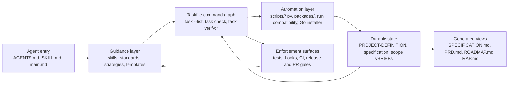
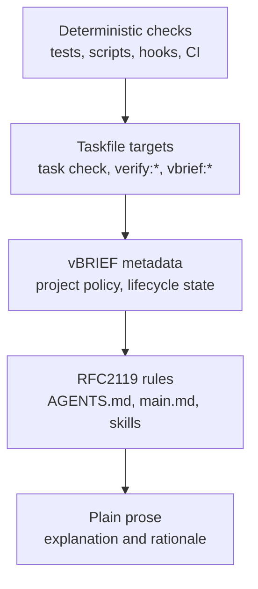
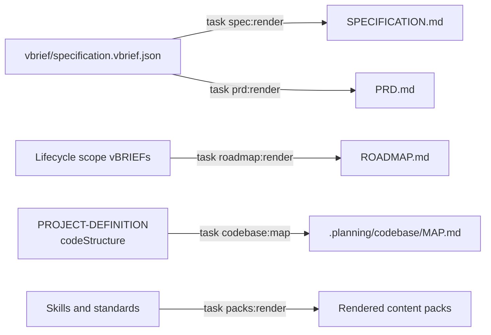
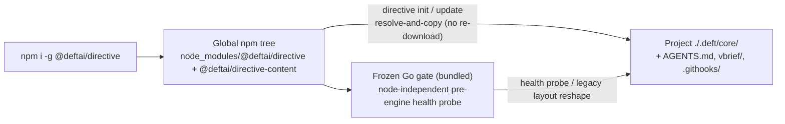
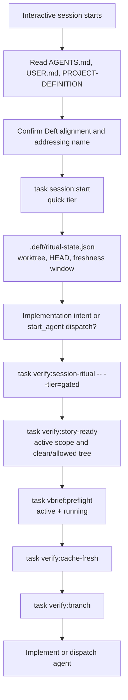
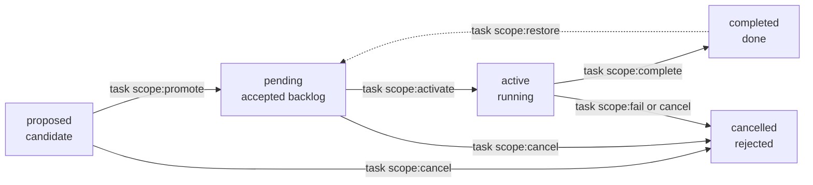
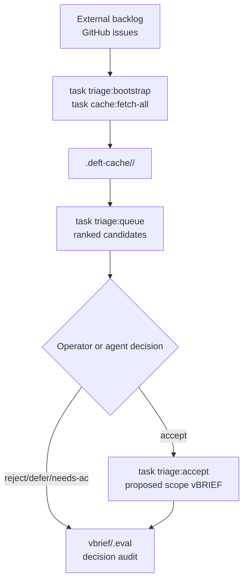

# Deft Architecture

How the Deft framework is wired today: authority layers, command surfaces, vBRIEF state, automation modules, generated artifacts, and the boundary between authored source of truth and derived views.

> **See also**: [CONCEPTS.md](./CONCEPTS.md) (operating principles) | [FILES.md](./FILES.md) (directory map) | [code-structure-profile.md](./code-structure-profile.md) | [codebase-map-source-of-truth.md](./codebase-map-source-of-truth.md) | [../README.md](../README.md)

## What Deft Is

Deft Directive is a self-dogfooded framework for AI-assisted software work. It is not just Markdown guidance and not just a CLI. The implemented system combines:

- Agent-consumed rules, skills, standards, strategies, and templates.
- A Taskfile-first deterministic command graph.
- Python tooling plus the TypeScript package engine for validation, rendering, lifecycle movement, cache/triage/scope automation, doctor checks, release support, codebase extraction contracts, CLI shims, and parity harnesses.
- npm packages (`@deftai/directive` + `@deftai/directive-content`) with TS-native `directive init` / `directive update` resolve-and-copy deposit into gitignored `.deft/core/`, plus a frozen Go binary retained only as a legacy layout bridge and node-independent health gate.
- vBRIEF files as durable project, specification, lifecycle, policy, and architecture metadata.
- Local cache/audit surfaces for backlog triage and GitHub issue ingestion.
- PR, release, swarm, branch-policy, and verification gates.
- Content packs for sliceable agent memory.
- Tests, hooks, and CI workflows that enforce the stronger rules.

`task --list` is the primary command discovery surface. `run`, `run.py`, and `run.bat` still exist for compatibility and selected interactive flows, but they are no longer the central architecture owner.

The original Deft intent still matters: move from one-off, vibe-level agent prompting toward a repeatable practice where standards are modular, context is loaded on demand, work is specified before implementation, tests anchor behavior, and the framework improves from its own lessons.

## System Shape

The loop is deliberate. Guidance tells agents how to behave, tasks make that behavior executable, vBRIEF files preserve state, generated views make state readable, and gates feed back into the guidance when the framework learns a better rule.

## Entry Surfaces

- `AGENTS.md` is the canonical agent entry point in this repository and in installer-wired consumer projects.
- `SKILL.md` is the alternate loader convention for platforms that discover skills directly.
- `main.md` holds general AI behavior and the current rule-authority axiom.
- `~/.config/deft/USER.md` stores personal preferences, with its Personal section taking precedence for user-defined preferences.
- `vbrief/PROJECT-DEFINITION.vbrief.json` stores project identity, policy, lifecycle registry, and authored architecture metadata.

Consumer installs point agents at `.deft/core/main.md`. The canonical path is `npm i -g @deftai/directive` followed by `directive init` (greenfield) or `directive update` (refresh) — both resolve the locally installed `@deftai/directive-content` package and copy it into gitignored `.deft/core/`. Legacy Go-installer and git-clone layouts are migration inputs, not the preferred target state.

## Rule Authority

Rules use the strongest applicable layer:

This is the current `main.md` rule-authority axiom: deterministic > Taskfile > vBRIEF > RFC2119 > prose. Prose explains rules but does not outrank executable gates.

Personal preferences from `USER.md` still matter, but when a rule has an executable check, the check is the rule body. For example, branch policy is described in prose, exposed by `task verify:branch`, enforced by hooks, and repeated in CI.

## Requirements Are Separate From Rules

Requirements describe what to build. Rules describe how agents should behave while doing the work.

- `vbrief/specification.vbrief.json` is the project specification source of truth.
- `SPECIFICATION.md` is a rendered view generated by `task spec:render`.
- `PRD.md` is a rendered stakeholder view generated by `task prd:render`.
- `ROADMAP.md` is a rendered backlog view generated by roadmap tasks.
- Scope vBRIEFs live in `vbrief/{proposed,pending,active,completed,cancelled}/`.

Generated markdown files carry machine-generated banners. Edit the vBRIEF source first, then render.

## Implemented Modules

| Area | Primary paths | Current responsibility |
| --- | --- | --- |
| Framework content | `AGENTS.md`, `main.md`, `coding/`, `contracts/`, `conventions/`, `docs/`, `interfaces/`, `languages/`, `meta/`, `patterns/`, `resilience/`, `scm/`, `skills/`, `strategies/`, `swarm/`, `templates/`, `tools/`, `verification/` | Agent guidance, skills, standards, and documentation. |
| Task runner | `Taskfile.yml`, `tasks/*.yml` | Deterministic command contract and composable command namespaces. |
| Python tooling | `scripts/*.py`, `run`, `run.py`, `run.bat` | Validators, renderers, lifecycle tools, issue/cache/triage automation, doctor/session gates, codebase provider contracts, and compatibility routing. |
| TypeScript engine | `packages/`, `package.json`, `pnpm-workspace.yaml`, `tsconfig*.json`, `vitest.config.ts` | Migrated deterministic gates, CLI shims, and Python-oracle parity harnesses for the #1530 engine migration. |
| Go installer (legacy bridge) | `cmd/deft-install/`, `go.mod` | Frozen cross-platform tarball deposit for offline/air-gapped and legacy layout migration; superseded by TS-native `directive init` / `directive update` for normal installs (#1942). |
| vBRIEF metadata | `vbrief/**/*.json`, `vbrief/**/*.md` | Project identity, scope lifecycle, schemas, policy, specification source, and authored `codeStructure`. |
| Content packs | `packs/` | Curated agent memory packs rendered and checked through `task packs:*`. |
| CI/release automation | `.github/`, `.githooks/`, `tasks/pr.yml`, `tasks/release.yml`, release scripts | Branch policy, PR readiness, release, publish, rollback, and local hook enforcement. |
| Tests | `tests/` | CLI, content, contract, lifecycle, and regression coverage. |

## npm-Native Distribution (current)

Distribution splits into two npm packages and a thin local materialization step. Shipped in Wave 5 ([#1669](https://github.com/deftai/directive/issues/1669), [#1942](https://github.com/deftai/directive/issues/1942)); the frozen Go binary role is further constrained by [#1933](https://github.com/deftai/directive/issues/1933) and [#1912](https://github.com/deftai/directive/issues/1912).

- **`@deftai/directive`** — the engine/CLI (Node 20+ required to *run* Deft). Binaries: `directive`, `deft`.
- **`@deftai/directive-content`** — the framework content (skills, templates, schemas, standards) shipped from the repo `content/` tree via the content package prepack. It is a **dependency** of the engine, so npm resolves a version-coherent pair at install time.

Key properties of the current model:

- **Global install ≠ project deposit.** `npm i -g` only places versioned files in the global npm tree; it never touches a project directory. `directive init` is the materialization step that **resolves the locally-installed `@deftai/directive-content` and copies its tree** into this project's `./.deft/core/`, then renders `AGENTS.md`, scaffolds `vbrief/`, wires `.githooks/` when present in the content tree, deposits #1430 neutralization, and stamps provenance. `directive update` refreshes the same way. This is **resolve-and-copy, not re-download** — the on-machine content package is the source (the `node_modules` model).
- **`.deft/core/` is gitignored** on greenfield installs and is reconstituted by `directive init` on fresh checkouts (like `node_modules`). Existing tracked deposits are migrated to hybrid by [#1941](https://github.com/deftai/directive/issues/1941).
- **Per-project version pinning** via `devDependencies` + `npx` gives teams/CI a reproducible engine↔content pair.
- **Frozen Go binary** stays bundled per-platform inside the npm package, but only as a **node-independent, read-only health gate** (every-session pre-engine probe) and a **legacy on-disk-layout reshaper**. It no longer fetches payloads or performs first-start installs (#1933).
- **Offline** = sideload both package tarballs, then `directive init` copies locally — no network in the happy path.
- **No surface bakes an install/upgrade command.** The engine, the Go gate, and `deft doctor` all point to the canonical install anchor in `README.md` rather than emitting a command that can go stale (#1912).

## Command Surface

The command graph is broad; use `task --list` for the exact current surface. The important architectural groups are:

- `task check`, `task check:framework-source`, `task check:consumer`, `task check:slow` for quality gates.
- `task verify:*` for branch, hooks, encoding, vBRIEF conformance, session ritual, story readiness, capacity, cache freshness, and investigation gates.
- `task vbrief:*`, `task spec:*`, `task project:*`, `task roadmap:*`, and `task prd:*` for source validation and generated views.
- `task scope:*` and `task scope:undo:*` for lifecycle movement.
- `task triage:*` and `task cache:*` for cache-backed backlog work.
- `task codebase:*` for authored `codeStructure` validation, default extraction, provider-map validation, MAP generation, and projection registry lookup.
- `task packs:*` for content-pack rendering and drift checks.
- `task pr:*`, `task release:*`, and `task swarm:*` for PR readiness, release operations, and multi-agent orchestration.
- `task policy:*`, `task capacity:*`, and `task scm:*` for project policy, work allocation, and SCM helpers.

`run` remains useful for compatibility and selected interactive commands such as `.deft/core/run bootstrap`, `.deft/core/run spec`, `.deft/core/run validate`, and `.deft/core/run doctor`. New deterministic automation should usually enter through Taskfile.

## Session Ritual And Gate Stack

Interactive sessions start with a quick ritual and become eligible for implementation only after the gated verifier records the heavier checks. The same state then feeds the story and implementation gates.

The ordering is architectural, not ceremony. Each gate can assume the previous one already proved its part of the state: session freshness, scope readiness, implementation intent, cache freshness, and branch policy.

## Lifecycle State

Work moves through vBRIEF lifecycle folders:

- `vbrief/proposed/` -- candidate work.
- `vbrief/pending/` -- accepted backlog.
- `vbrief/active/` -- running work.
- `vbrief/completed/` -- completed work.
- `vbrief/cancelled/` -- rejected or abandoned work.

The folder and `plan.status` must agree. The scope tasks update both together. `task verify:story-ready` and `task vbrief:preflight` are the implementation-intent gates for active work.

## Triage And Cache

Deft's backlog workflow is cache-backed:

- `.deft-cache/` stores fetched external content.
- `vbrief/.eval/` stores triage decisions and audit records.
- `task triage:bootstrap` seeds the local cache and audit layer.
- `task triage:queue`, `task triage:accept`, `task triage:reject`, `task triage:defer`, and related verbs turn external issues into auditable scope decisions.

Agents should not choose backlog work from memory when the cache workflow applies. They should consult the cache/task surface first.

## Codebase Architecture Metadata

`vbrief/PROJECT-DEFINITION.vbrief.json` contains `plan.architecture.codeStructure`, the authored codebase-structure profile. That profile is the durable source of truth for intended module boundaries.

Implemented today:

- `task codebase:validate-structure`
- `task codebase:extract-default`
- `task codebase:provider-map`
- `task codebase:map`
- `task codebase:projection-registry`
- `task verify:codebase-map-fresh`
- Consumer-facing MAP guidance in `AGENTS.md`, `templates/agents-entry.md`,
  and the build/sync/pre-pr skills.

Not implemented yet:

- Generated source headers
- Local indexes or mandatory consumer hard-gates for MAP consumption

The generated MAP is a projection. It must not become the canonical architecture source.

## Generated And Historical Artifacts

- `SPECIFICATION.md`, `PRD.md`, and `ROADMAP.md` are generated views.
- `.planning/codebase/MAP.md` is a generated codebase orientation projection.
- `.planning/codebase/ARCHITECTURE.md`, `CONVENTIONS.md`, and related files are historical planning notes unless they carry a generated-source banner.
- `PROJECT.md` is a deprecated redirect; current project identity lives in `vbrief/PROJECT-DEFINITION.vbrief.json`.

When in doubt, prefer the vBRIEF source and the Taskfile gate over a prose file.
