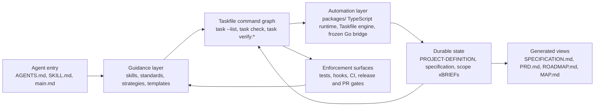
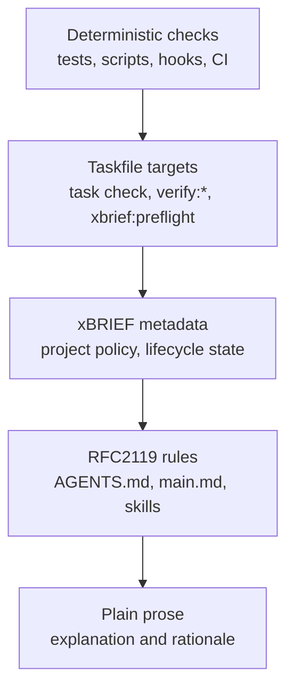
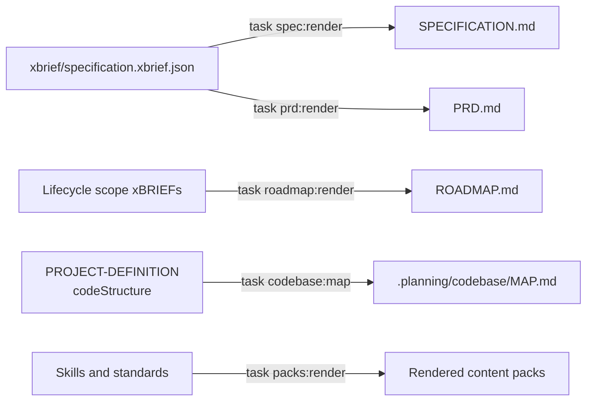
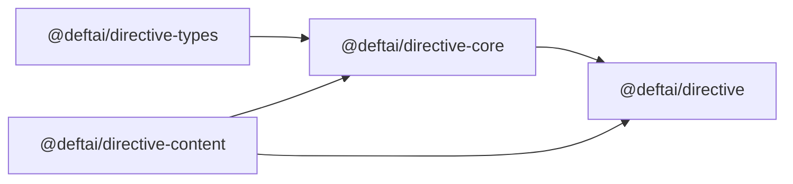
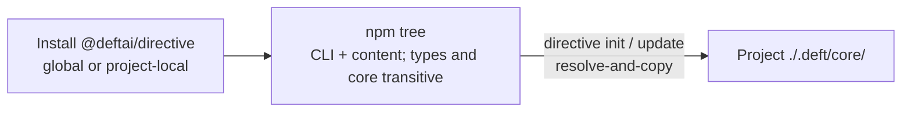
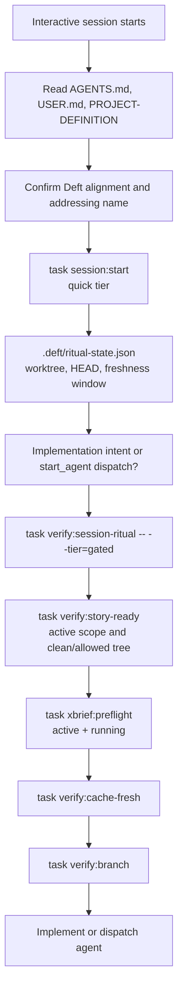
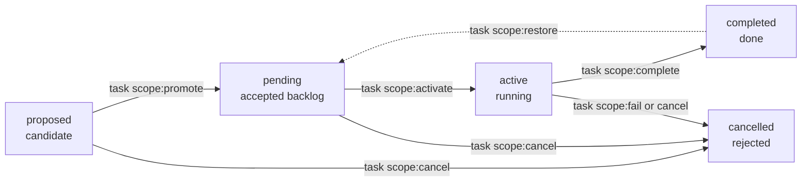
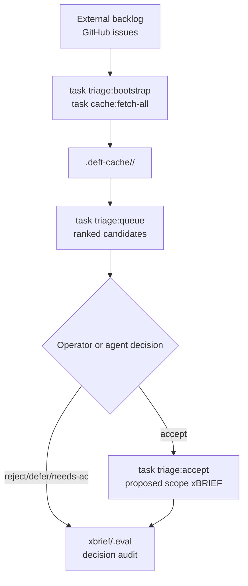

# Deft Architecture

How the Deft framework is wired today: authority layers, command surfaces, xBRIEF state, automation modules, generated artifacts, and the boundary between authored source of truth and derived views.

> **Naming (#2907):** **xBRIEF** / `xbrief/` is the sole public work-state name; **vBRIEF** is legacy. See [UPGRADING.md — xBRIEF rename](../content/UPGRADING.md#xbrief-rename-2034--2110--2907).

> **See also**: [CONCEPTS.md](./CONCEPTS.md) (operating principles) | [FILES.md](./FILES.md) (directory map) | [code-structure-profile.md](./code-structure-profile.md) | [codebase-map-source-of-truth.md](./codebase-map-source-of-truth.md) | [../README.md](../README.md)

## What Deft Is

Deft Directive is a self-dogfooded framework for AI-assisted software work. It is not just Markdown guidance and not just a CLI. The implemented system combines:

- Agent-consumed rules, skills, standards, strategies, and templates.
- TypeScript packages under `packages/` as the implementation and runtime owner (validation, rendering, lifecycle, cache/triage/scope, doctor, release support, CLI).
- Taskfile as the repository command facade (`task --list`, `task check`, `task verify:*`).
- `deft` / `directive` as the installed consumer CLI.
- `deft-hook` and native CLI verbs as host and Git-hook entrypoints.
- Four published npm packages (`@deftai/directive-types`, `@deftai/directive-core`, `@deftai/directive-content`, `@deftai/directive`). TypeScript `directive init` / `directive update` is the happy-path consumer materialization into gitignored `.deft/core/`. A frozen Go installer remains a bounded networked-deposit bridge (not the happy path, not deleted). Package graph, publish sequence, and install topology are in [npm-Native Distribution](#npm-native-distribution-current). This document does not prejudge [#1979](https://github.com/deftai/directive/issues/1979).
- xBRIEF files as durable project, specification, lifecycle, policy, and architecture metadata.
- Local cache/audit surfaces for backlog triage and GitHub issue ingestion.
- PR, release, swarm, branch-policy, and verification gates.
- Content packs for sliceable agent memory.
- Tests, hooks, and CI workflows that enforce the stronger rules.

`task --list` is the repository command discovery surface. New deterministic automation enters through Taskfile, which dispatches the TypeScript CLI in this checkout.

> **Historical (Python/run era):** root `run`, `run.py`, and `run.bat` launchers, plus `scripts/*.py` validators, were the previous automation layer. They are removed from the current tree. Do not add work there.

The original Deft intent still matters: move from one-off, vibe-level agent prompting toward a repeatable practice where standards are modular, context is loaded on demand, work is specified before implementation, tests anchor behavior, and the framework improves from its own lessons.

## System Shape

```mermaid
flowchart LR
    A["Agent entry<br/>AGENTS.md, SKILL.md, main.md"] --> B["Guidance layer<br/>skills, standards, strategies, templates"]
    B --> C["Taskfile command graph<br/>task --list, task check, task verify:*"]
    C --> D["Automation layer<br/>packages/ TypeScript runtime, Taskfile engine, frozen Go bridge"]
    D --> E["Durable state<br/>PROJECT-DEFINITION, specification, scope xBRIEFs"]
    E --> F["Generated views<br/>SPECIFICATION.md, PRD.md, ROADMAP.md, MAP.md"]
    E --> C
    C --> G["Enforcement surfaces<br/>tests, hooks, CI, release and PR gates"]
    G --> B
```

The loop is deliberate. Guidance tells agents how to behave, tasks make that behavior executable, xBRIEF files preserve state, generated views make state readable, and gates feed back into the guidance when the framework learns a better rule.

## Entry Surfaces

- `AGENTS.md` is the canonical agent entry point in this repository and in installer-wired consumer projects.
- `SKILL.md` is the alternate loader convention for platforms that discover skills directly.
- `main.md` holds general AI behavior and the current rule-authority axiom.
- `~/.config/deft/USER.md` stores personal preferences, with its Personal section taking precedence for user-defined preferences.
- `xbrief/PROJECT-DEFINITION.xbrief.json` stores project identity, policy, lifecycle registry, and authored architecture metadata.

Consumer installs point agents at `.deft/core/main.md`. TypeScript `directive init` (greenfield) or `directive update` (refresh) is the happy-path materialization: both resolve the locally installed `@deftai/directive-content` package and copy it into gitignored `.deft/core/`. Global and project-local npm installs are both current; install commands live in [README.md](../README.md). Legacy Go-installer and git-clone layouts are migration inputs, not the preferred target state.

## Rule Authority

Rules use the strongest applicable layer:

```mermaid
flowchart TD
    D["Deterministic checks<br/>tests, scripts, hooks, CI"] --> T["Taskfile targets<br/>task check, verify:*, xbrief:preflight"]
    T --> V["xBRIEF metadata<br/>project policy, lifecycle state"]
    V --> R["RFC2119 rules<br/>AGENTS.md, main.md, skills"]
    R --> P["Plain prose<br/>explanation and rationale"]
```

This is the current `main.md` rule-authority axiom: deterministic > Taskfile > xBRIEF > RFC2119 > prose. Prose explains rules but does not outrank executable gates.

Personal preferences from `USER.md` still matter, but when a rule has an executable check, the check is the rule body. For example, branch policy is described in prose, exposed by `task verify:branch`, enforced by hooks, and repeated in CI.

## Requirements Are Separate From Rules

Requirements describe what to build. Rules describe how agents should behave while doing the work.

- `xbrief/specification.xbrief.json` is the project specification source of truth.
- `SPECIFICATION.md` is a rendered view generated by `task spec:render`.
- `PRD.md` is a rendered stakeholder view generated by `task prd:render`.
- `ROADMAP.md` is a rendered forward-looking backlog view (`pending/` + `proposed/` + `active/`, completed capped) generated by `task roadmap:render`. Orientation only — work selection still uses `triage:queue` / plan-sequence.
- Scope xBRIEFs live in `xbrief/{proposed,pending,active,completed,cancelled}/`.

Generated markdown files carry machine-generated banners. Edit the xBRIEF source first, then render.

```mermaid
flowchart LR
    S["xbrief/specification.xbrief.json"] -->|"task spec:render"| SM["SPECIFICATION.md"]
    S -->|"task prd:render"| PRD["PRD.md"]
    L["Lifecycle scope xBRIEFs"] -->|"task roadmap:render"| RM["ROADMAP.md"]
    P["PROJECT-DEFINITION<br/>codeStructure"] -->|"task codebase:map"| MAP[".planning/codebase/MAP.md"]
    Skills["Skills and standards"] -->|"task packs:render"| Packs["Rendered content packs"]
```

## Implemented Modules

| Area | Primary paths | Current responsibility |
| --- | --- | --- |
| Framework content | `AGENTS.md`, `main.md`, `content/`, `docs/` | Agent guidance, skills, standards, and documentation. Shipped guidance lives under `content/`; `docs/` is repo-dev orientation. |
| Task runner | `Taskfile.yml`, `tasks/*.yml` | Repository command facade: deterministic command contract and composable namespaces. |
| TypeScript packages | `packages/`, `package.json`, `pnpm-workspace.yaml`, `tsconfig*.json`, `vitest.config.ts` | Implementation and runtime owner for gates, the `deft` / `directive` CLI, and `deft-hook`. |
| Go installer (frozen bridge) | `cmd/deft-install/`, `go.mod` | Frozen GitHub-release binary: `deft-install gate`, legacy-layout reshape for inputs TypeScript init/update refuse, and networked tarball deposit. Not the happy-path consumer path. Not bundled in the npm package. Not deleted. [#1979](https://github.com/deftai/directive/issues/1979) is open. |
| xBRIEF metadata | `xbrief/**/*.json`, `xbrief/**/*.md` | Project identity, scope lifecycle, schemas, policy, specification source, and authored `codeStructure`. |
| Content packs | `content/packs/` | Curated agent memory packs rendered and checked through `task packs:*`. |
| CI/release automation | `.github/`, `.githooks/`, `tasks/pr.yml` | Branch policy, PR readiness, release, publish, rollback, and local hook enforcement. |
| Tests | `tests/`, `packages/*/src/**/*.test.ts` | CLI, content, contract, lifecycle, and regression coverage. |

> **Historical (Python/run era):** `scripts/*.py`, `run`, `run.py`, and `run.bat` used to own validators and compatibility routing. They are not current modules.

## npm-Native Distribution (current)

This section is the canonical package and installation topology. Two labeled facts stay separate: **workspace dependency edges** come from `packages/*/package.json`; **publish sequence** comes from `.github/workflows/npm-publish.yml` and is an ordered list, not those edges. The sequence is not a topological sort of the workspace graph (core publishes before content, which it depends on). This document records the observed sequence; it does not change the workflow. Install commands live in [README.md](../README.md) (#1912). This topology does not prejudge [#1979](https://github.com/deftai/directive/issues/1979). Node run requirements for consumers versus maintainers are not this topology.

The repository publishes four npm packages. `@deftai/directive-types` is the supported public contract. `@deftai/directive-core` is published for npm dependency resolution but is not a supported library. `@deftai/directive-content` is the deposit payload. `@deftai/directive` is the consumer CLI (`directive`, `deft`).

### Published workspace (manifest edges)

| Package | Role | Support | Workspace dependencies |
| --- | --- | --- | --- |
| `@deftai/directive-types` | public contract | supported | (none) |
| `@deftai/directive-content` | deposit payload | supported install material | (none) |
| `@deftai/directive-core` | engine library | published, not a supported library | `@deftai/directive-types`, `@deftai/directive-content` |
| `@deftai/directive` | consumer CLI | supported | `@deftai/directive-core`, `@deftai/directive-content` |

Workspace dependency edges (from `packages/*/package.json`):

- `@deftai/directive-types` -> `@deftai/directive-core`
- `@deftai/directive-content` -> `@deftai/directive-core`
- `@deftai/directive-content` -> `@deftai/directive`
- `@deftai/directive-core` -> `@deftai/directive`

```mermaid
flowchart LR
    Types["@deftai/directive-types"]
    Content["@deftai/directive-content"]
    Core["@deftai/directive-core"]
    Cli["@deftai/directive"]
    Types --> Core
    Content --> Core
    Content --> Cli
    Core --> Cli
```

### Observed publish sequence

Observed publish sequence from `.github/workflows/npm-publish.yml` (ordered list, not dependency order, not a topological sort of the workspace graph):

1. `@deftai/directive-types`
2. `@deftai/directive-core`
3. `@deftai/directive-content`
4. `@deftai/directive`

### Consumer install and deposit path

TypeScript `directive init` / `directive update` is the happy-path consumer materialization. After `@deftai/directive` is installed (global or project-local; commands in README), those verbs resolve the locally installed `@deftai/directive-content` package and copy it into gitignored `./.deft/core/`. Types and core are transitive. Core is not a supported library. This is resolve-and-copy, not a re-download.

```mermaid
flowchart LR
    Install["Install @deftai/directive<br/>global or project-local"] --> Tree["npm tree<br/>CLI + content; types and core transitive"]
    Tree -->|"directive init / update<br/>resolve-and-copy"| Deposit["Project ./.deft/core/"]
```

Key properties:

- **Global install ≠ project deposit.** Installing the CLI only places versioned files in the npm tree. `directive init` materializes `./.deft/core/`, then renders `AGENTS.md`, scaffolds `xbrief/`, wires `.githooks/` when present, deposits #1430 neutralization, and stamps provenance. `directive update` refreshes the same way.
- **`.deft/core/` is gitignored** on greenfield installs and is reconstituted by `directive init` on fresh checkouts (like `node_modules`). Existing tracked deposits are migrated to hybrid by [#1941](https://github.com/deftai/directive/issues/1941).
- **Per-project version pinning** via `devDependencies` + `npx` gives teams/CI a reproducible engine↔content pair.
- **Sideload** of the npm package tarballs still works: `directive init` copies locally with no extra network in that happy path.
- **No surface bakes an install/upgrade command.** The engine, the frozen Go bridge, and `deft doctor` point at README rather than emitting a command that can go stale (#1912).

### Frozen Go bridge

The frozen Go binary is a **separate GitHub release asset**, not a file inside the `@deftai/directive` npm tarball. It is a bounded networked-deposit bridge, not the happy path, and not deleted. It is not an offline capability: deposit still fetches a release tarball. [#1979](https://github.com/deftai/directive/issues/1979) (whether to delete the Go source and build matrix) stays open.

Current Go jobs:

1. `deft-install gate` — node-independent health probe.
2. Legacy-layout stage-1 reshape for on-disk layouts that TypeScript `directive init` / `directive update` refuse.
3. Networked tarball deposit/migration — retained on the binary, not the happy-path consumer update.

Shipped in Wave 5 ([#1669](https://github.com/deftai/directive/issues/1669), [#1942](https://github.com/deftai/directive/issues/1942)); freeze constraints: [#1933](https://github.com/deftai/directive/issues/1933), [#1912](https://github.com/deftai/directive/issues/1912).

## Command Surface

These are separate lanes. Do not collapse them into "Taskfile-first runtime."

| Lane | Owner | Role |
| --- | --- | --- |
| TypeScript packages | `packages/` | Implementation and runtime owner |
| Taskfile | `Taskfile.yml`, `tasks/*.yml` | Repository command facade for maintainers, agents, and CI in this checkout |
| Installed consumer CLI | `deft` / `directive` | What consumer projects run after `npm i -g @deftai/directive` |
| Git-hook entrypoints | `.githooks/_deft-run.sh` → `deft` / native CLI verbs (`verify:branch`, `verify:encoding`, `preflight-gh`, ...) | What tracked `.githooks/` invoke |
| Host integrations | `deft-hook` | Agent-host hook runtime; not the Git-hook resolver |

The command graph is broad; use `task --list` for the exact current surface. The important architectural groups are:

- `task check`, `task check:framework-source`, `task check:consumer`, `task check:slow` for quality gates.
- `task verify:*` for branch, hooks, encoding, xBRIEF conformance, session ritual, story readiness, capacity, cache freshness, and investigation gates.
- `task vbrief:validate`, `task xbrief:preflight` (prefer; `vbrief:preflight` remains as alias), `task spec:*`, `task project:*`, `task roadmap:*`, and `task prd:*` for source validation and generated views.
- `task scope:*` and `task scope:undo:*` for lifecycle movement.
- `task triage:*` and `task cache:*` for cache-backed backlog work.
- `task codebase:*` for authored `codeStructure` validation, default extraction, provider-map validation, MAP generation, and projection registry lookup.
- `task packs:*` for content-pack rendering and drift checks.
- `task pr:*`, `task release:*`, and `task swarm:*` for PR readiness, release operations, and multi-agent orchestration.
- `task policy:*`, `task capacity:*`, and `task scm:*` for project policy, work allocation, and SCM helpers.

New deterministic automation should enter through Taskfile in this checkout, or through `deft` / `directive` in a consumer install. Tracked Git hooks invoke native CLI verbs through `.githooks/_deft-run.sh` (the `deft` resolver), not `deft-hook` and not Python launchers. `deft-hook` is the agent-host integration binary.

## Session Ritual And Gate Stack

Interactive sessions start with a quick ritual and become eligible for implementation only after the gated verifier records the heavier checks. The same state then feeds the story and implementation gates.

```mermaid
flowchart TD
    Start["Interactive session starts"] --> Read["Read AGENTS.md, USER.md, PROJECT-DEFINITION"]
    Read --> Confirm["Confirm Deft alignment and addressing name"]
    Confirm --> Quick["task session:start<br/>quick tier"]
    Quick --> State[".deft/ritual-state.json<br/>worktree, HEAD, freshness window"]
    State --> Intent["Implementation intent or start_agent dispatch?"]
    Intent --> Gated["task verify:session-ritual -- --tier=gated"]
    Gated --> Story["task verify:story-ready<br/>active scope and clean/allowed tree"]
    Story --> Preflight["task xbrief:preflight<br/>active + running"]
    Preflight --> Cache["task verify:cache-fresh"]
    Cache --> Branch["task verify:branch"]
    Branch --> Work["Implement or dispatch agent"]
```

The ordering is architectural, not ceremony. Each gate can assume the previous one already proved its part of the state: session freshness, scope readiness, implementation intent, cache freshness, and branch policy.

## Lifecycle State

Work moves through xBRIEF lifecycle folders:

- `xbrief/proposed/` -- candidate work.
- `xbrief/pending/` -- accepted backlog.
- `xbrief/active/` -- running work.
- `xbrief/completed/` -- completed work.
- `xbrief/cancelled/` -- rejected or abandoned work.

The folder and `plan.status` must agree. The scope tasks update both together. `task verify:story-ready` and `task xbrief:preflight` are the implementation-intent gates for active work.

```mermaid
flowchart LR
    Proposed["proposed<br/>candidate"] -->|"task scope:promote"| Pending["pending<br/>accepted backlog"]
    Pending -->|"task scope:activate"| Active["active<br/>running"]
    Active -->|"task scope:complete"| Completed["completed<br/>done"]
    Proposed -->|"task scope:cancel"| Cancelled["cancelled<br/>rejected"]
    Pending -->|"task scope:cancel"| Cancelled
    Active -->|"task scope:fail or cancel"| Cancelled
    Completed -.->|"task scope:restore"| Pending
```

## Triage And Cache

Deft's backlog workflow is cache-backed:

- `.deft-cache/` stores fetched external content.
- `<lifecycle-root>/.triage-cache/` (e.g. `xbrief/.triage-cache/`) stores triage decisions and audit records; `<lifecycle-root>/.eval/results/` stores framework-eval ledgers (#1703).
- `task triage:bootstrap` seeds the local cache and audit layer.
- `task triage:queue`, `task triage:accept`, `task triage:reject`, `task triage:defer`, and related verbs turn external issues into auditable scope decisions.

Agents should not choose backlog work from memory when the cache workflow applies. They should consult the cache/task surface first.

```mermaid
flowchart TD
    GH["External backlog<br/>GitHub issues"] --> Fetch["task triage:bootstrap<br/>task cache:fetch-all"]
    Fetch --> Cache[".deft-cache/<source>/<key>"]
    Cache --> Queue["task triage:queue<br/>ranked candidates"]
    Queue --> Decision{"Operator or agent decision"}
    Decision -->|"accept"| Scope["task triage:accept<br/>proposed scope xBRIEF"]
    Decision -->|"reject/defer/needs-ac"| Audit["xbrief/.eval<br/>decision audit"]
    Scope --> Audit
```

## Codebase Architecture Metadata

`xbrief/PROJECT-DEFINITION.xbrief.json` contains `plan.architecture.codeStructure`, the authored codebase-structure profile. That profile is the durable source of truth for intended module boundaries.

Implemented today:

- `task codebase:validate-structure`
- `task codebase:extract-default`
- `task codebase:provider-map`
- `task codebase:map`
- `task codebase:projection-registry`
- `task verify:codebase-map-fresh`
- Consumer-facing MAP guidance in `AGENTS.md`, `templates/agents-entry.md`,
  and the build/sync/pre-pr skills.

Not implemented yet:

- Generated source headers
- Local indexes or mandatory consumer hard-gates for MAP consumption

The generated MAP is a projection. It must not become the canonical architecture source.

## Generated And Historical Artifacts

- `SPECIFICATION.md`, `PRD.md`, and `ROADMAP.md` are generated views.
- `.planning/codebase/MAP.md` is a generated codebase orientation projection.
- `.planning/codebase/ARCHITECTURE.md`, `CONVENTIONS.md`, and related files are historical planning notes unless they carry a generated-source banner.
- `PROJECT.md` is a deprecated redirect; current project identity lives in `xbrief/PROJECT-DEFINITION.xbrief.json`.

When in doubt, prefer the xBRIEF source and the Taskfile gate over a prose file.
