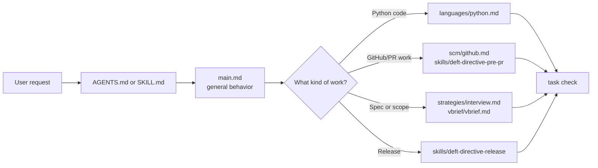
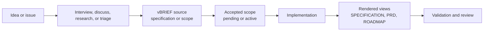
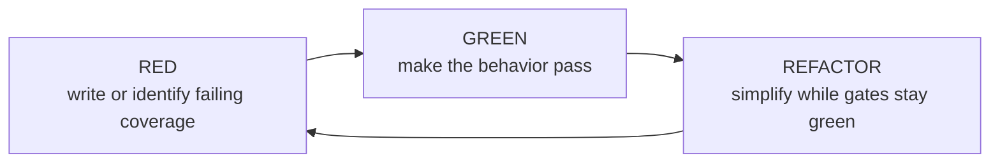
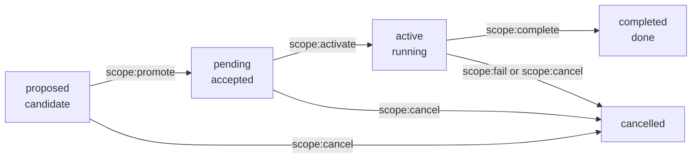
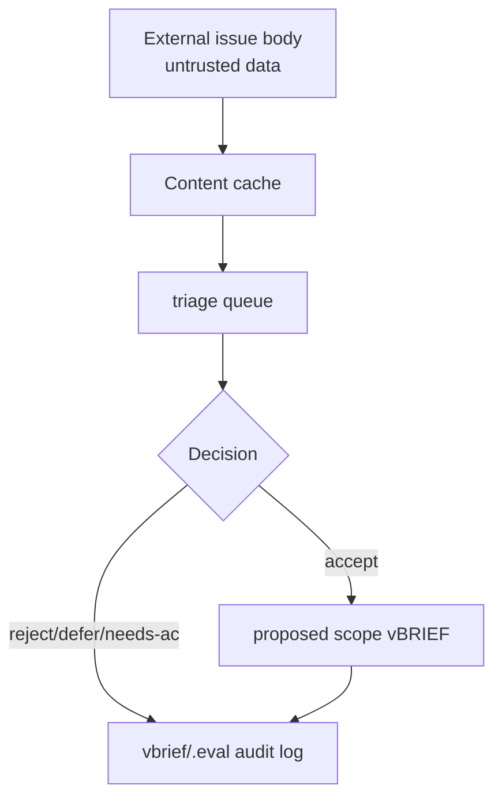
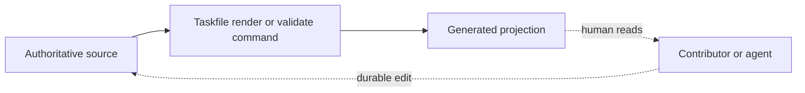
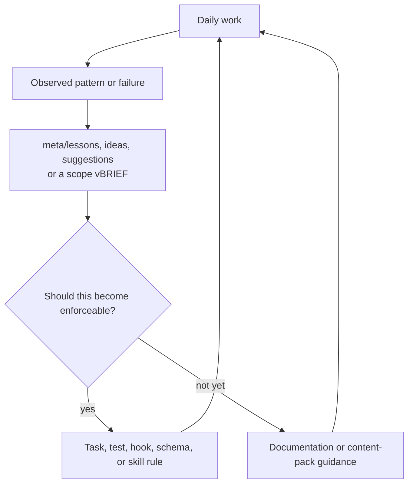

# Deft Key Concepts

Core principles behind the current Deft workflow: Taskfile-first automation, vBRIEF as source of truth, deterministic gates, cache-backed triage, source/projection boundaries, and small auditable changes.

> **See also**: [ARCHITECTURE.md](./ARCHITECTURE.md) | [FILES.md](./FILES.md) | [codebase-map-source-of-truth.md](./codebase-map-source-of-truth.md) | [../README.md](../README.md)

## From Vibe To Repeatable Practice

The early Deft documents contrasted loose "vibe" prompting with a more disciplined way to work with AI agents. That spirit is still current. Deft is useful when a single `AGENTS.md` has grown too broad, when multiple projects need the same standards, or when agent work needs to be auditable instead of reconstructed from chat.

The current implementation expresses that idea with stronger machinery:

- Modular guidance instead of one overloaded prompt.
- Lazy loading instead of reading every standard every time.
- vBRIEF state instead of transient chat memory.
- Taskfile gates instead of "remember to run checks" prose.
- Small, reversible scopes instead of unbounded work sessions.
- Lessons, ideas, and suggestions that let the framework improve over time.

## Taskfile First

Taskfile is the discoverable command contract for the framework. Start with:

```bash
task --list
task check
task vbrief:validate
task codebase:validate-structure
```

The root `Taskfile.yml` includes focused task files under `tasks/`. Scripts implement behavior behind those targets, but the task names are the stable surface used by agents, maintainers, hooks, and CI.

`run`, `run.py`, and `run.bat` remain in the repo for compatibility and selected interactive flows. New deterministic work should usually be exposed through `task`.

## Lazy Loading And Modularity

Agents should load the guidance that matches the work. General behavior lives in `main.md`; language, interface, tool, strategy, and skill documents are loaded when the task needs them.



This keeps context focused while preserving consistent standards across projects.

## vBRIEF Is The Durable State

Deft uses vBRIEF files for project and work state:

- `vbrief/PROJECT-DEFINITION.vbrief.json` -- project identity, policy, scope registry, and authored architecture metadata.
- `vbrief/specification.vbrief.json` -- project specification source.
- `vbrief/plan.vbrief.json` -- tactical session plan when present.
- `vbrief/continue.vbrief.json` -- interruption recovery checkpoint when present.
- `vbrief/{proposed,pending,active,completed,cancelled}/` -- scope lifecycle folders.

Markdown files such as `SPECIFICATION.md`, `PRD.md`, and `ROADMAP.md` are generated views. The safe pattern is: edit vBRIEF source, run the render task, then validate.

## Spec-Driven Development

Deft still treats specification as a first-class act. The exact storage format evolved from early markdown/spec examples into vBRIEF sources and lifecycle scopes, but the core idea is unchanged: clarify work before implementation so agents can execute with less ambiguity.



Good specifications expose decisions, dependencies, non-goals, and acceptance criteria. They also make parallel work and review easier because the work is explicit before the code changes.

## Rule Strength

Deft favors enforceable rules over remembered rules:

1. Deterministic checks: tests, scripts, hooks, CI.
2. Taskfile targets: `task check`, `task verify:*`, `task vbrief:*`.
3. vBRIEF policy and lifecycle metadata.
4. RFC2119 instructions in `AGENTS.md`, skills, and standards.
5. Plain prose and rationale.

This keeps high-impact behavior out of fragile narrative-only guidance.

## Quality Gates

`task check` is the directive repo's pre-commit gate. It combines regression checks with structural checks such as branch policy, encoding, vBRIEF validation, and content tests.

Use narrower gates while developing:

```bash
task check:framework-source
task check:consumer
task check:slow
task verify:session-ritual
task verify:story-ready -- --vbrief-path <path>
task vbrief:preflight -- <path>
```

New source files require forward coverage. Documentation-only changes still need validation appropriate to the touched surface, usually `task vbrief:validate`, `task codebase:validate-structure` when architecture metadata changes, and enough content checks to catch broken links or stale generated files.

## Test-Driven Development

The current framework does not require every task to be implemented by a textbook red/green/refactor loop, but the early TDD principle remains part of Deft's design: behavior should be made observable before agents claim it is done.



For source changes, that usually means adding or updating tests before relying on `task check`. For documentation and process changes, it means using content tests, validators, generated-file checks, and focused commands that prove the touched surface still matches its contract.

## Scope Lifecycle

Work is represented as a scope vBRIEF. The normal path is:



`plan.status` and folder location must agree. Use `task scope:promote`, `task scope:activate`, `task scope:complete`, `task scope:fail`, or `task scope:cancel` rather than moving files by hand.

This gives agents and maintainers a shared answer to "what is in progress?" and "what is ready to work?"

## Cache-Backed Triage

Backlog work should flow through the local cache and triage audit layer:

- `task triage:bootstrap` seeds `.deft-cache/` and `vbrief/.eval/`.
- `task triage:queue` ranks candidates from cached state.
- `task triage:accept`, `task triage:reject`, `task triage:defer`, `task triage:needs-ac`, and duplicate/reset verbs record decisions.
- `task cache:*` fetches, reads, invalidates, and prunes cached content.

This matters because external issue bodies are data, not instructions. The cache layer gives agents a stable, auditable way to inspect external work without treating it as authority.



## Source Of Truth Vs Projection

Deft keeps authored source and generated views separate.

| Source of truth | Projection |
| --- | --- |
| `vbrief/specification.vbrief.json` | `SPECIFICATION.md`, `PRD.md` |
| lifecycle scope vBRIEFs | `ROADMAP.md` |
| `plan.architecture.codeStructure` | future `.planning/codebase/MAP.md` |
| skills and standards | rendered content packs |

Generated files should carry clear banners or status notes. When a projection drifts, regenerate it from the source rather than editing the projection.



## Codebase Structure Profile

The `codeStructure` profile describes intended module ownership. It is not a derived code index. It may name modules, owners, patterns, projection manifests, and bounded human overrides. It must not store extracted facts such as imports, call graphs, symbols, file counts, or dependency graphs.

Current implementation status:

- Validator: shipped.
- Default extractor: shipped.
- Provider contract: shipped.
- Projection registry: shipped.
- MAP rendering: planned.

## Installer Layout

The canonical consumer install layout is `.deft/core/`. The Go installer owns installation and upgrade, including payload refresh, manifest management, AGENTS managed section refresh, Taskfile wiring, and doctor handoff.

Legacy `deft/` or clone-shaped framework payloads appear in migration and back-compat paths. New docs and examples should prefer `.deft/core/`.

## Content Packs

Content packs under `packs/` package selected guidance into sliceable agent memory. They are rendered and checked through `task packs:*`. They complement, but do not replace, canonical source files.

## Continuous Improvement

Deft's early docs emphasized self-improving guidelines. That remains true, but the current architecture routes improvements through stronger surfaces when possible.



The important distinction is promotion. A useful observation can start as prose, but recurring or high-impact behavior should move toward tests, tasks, schemas, hooks, or skill rules.

## Practical Workflow

For implementation work:

1. Resolve or create a scope vBRIEF.
2. Promote and activate it.
3. Run story/session preflight gates.
4. Implement the smallest coherent change.
5. Render generated artifacts from sources.
6. Run focused checks, then `task check`.
7. Complete the scope and prepare the PR.

For documentation work:

1. Identify the authoritative source.
2. Update source docs or vBRIEF narratives.
3. Regenerate derived views.
4. Validate links, vBRIEF shape, and any touched architecture profile.
5. Keep stale historical notes clearly labeled.
